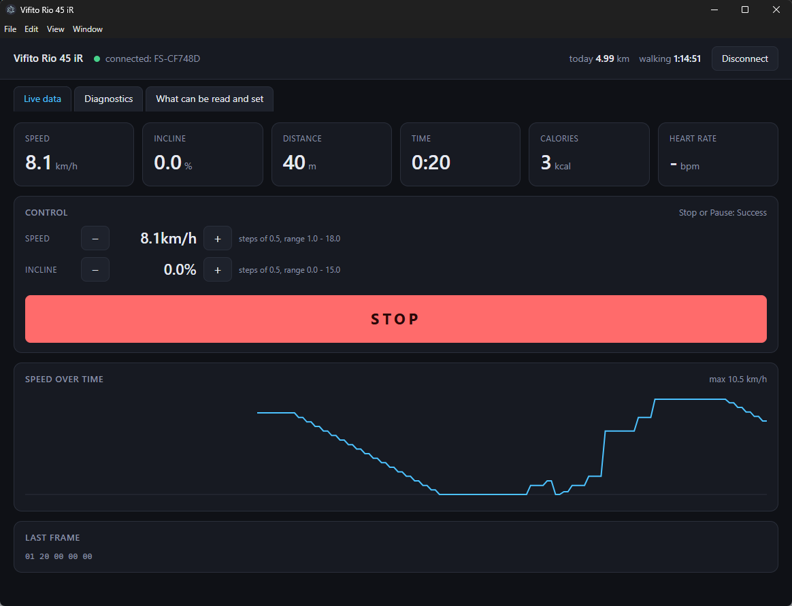

# Vifito Desktop

[](https://github.com/ludekvodicka/VifitoDesktop/actions/workflows/ci.yml)
[](https://github.com/ludekvodicka/VifitoDesktop/actions/workflows/release.yml)
[](https://github.com/ludekvodicka/VifitoDesktop/releases/latest)
[](https://github.com/ludekvodicka/VifitoDesktop/releases)
[](LICENSE)

A small desktop app that connects to a **VIFITO Rio 45 iR** walking treadmill over Bluetooth Low
Energy and shows what the console is doing: speed, incline, distance, time, calories and heart rate,
plus a running total of how far you walked today. From the same screen you can set the speed and the
incline, and stop the belt.

It speaks the standard Bluetooth SIG **Fitness Machine Service** (FTMS, `0x1826`), the same protocol
Zwift, Kinomap and FitShow use, so it has a fair chance of working with other treadmills whose
console advertises FTMS. It was written and tested against a Rio 45 iR under a standing desk.



## Controlling the treadmill

Control goes through the FTMS Control Point (`0x2AD9`): the app takes control, then sends Set Target
Speed, Set Target Inclination, Start or Resume, and Stop. All four work on a Rio 45 iR with a FitShow
console, tested on the belt. On any other console it is an open question, so every command is
answered and the answer is shown in the Control panel, refusals like *Op Code not supported* or
*Control Not Permitted* included.

Moving a belt from software deserves care, so:

- **Nothing is ever sent on its own.** Every command comes from a click. The app does not restore a
  previous speed, does not resume after a reconnect, and sends nothing at startup.
- **Control is taken lazily**, on the first command you issue, not when you connect. Some consoles
  lock their own panel once a remote takes over, and just watching the numbers must not do that.
- **Start always starts at the lowest speed** the console supports, and the button says which speed
  that is before you press it. It also refuses to start at all unless the console has accepted that
  speed first, so the belt never starts at whatever the console had in mind.
- **Stop is one click and jumps ahead of anything queued.**
- The console's own stop button and safety key are unaffected. This app is an extra remote, not a
  replacement for them.

## Your data stays on your machine

Samples are appended to a local JSONL file, one per day, and nothing is ever sent anywhere. There is
no telemetry, no account, and no network traffic other than the update check against GitHub Releases.

| build | log location |
| --- | --- |
| installed | `<userData>/data/sessions/YYYY-MM-DD.jsonl` (`%APPDATA%/Vifito Desktop` on Windows, `~/Library/Application Support/Vifito Desktop` on macOS, `~/.config/Vifito Desktop` on Linux) |
| from source | `data/sessions/YYYY-MM-DD.jsonl` in the project directory |

Delete the file and the day's history is gone. It is plain text, one JSON object per line.

## Install

Download the build for your platform from [Releases](https://github.com/ludekvodicka/VifitoDesktop/releases).

**The builds are unsigned.** Verify the SHA256 of your download against `SHA256SUMS.txt` in the same
release before running it:

```sh
sha256sum Vifito-Desktop-Setup-0.1.0-x64.exe    # Linux, macOS, Git Bash
certutil -hashfile Vifito-Desktop-Setup-0.1.0-x64.exe SHA256   # Windows
```

- **Windows** - `Setup` installs and can update itself from GitHub Releases; `Portable` is a single
  executable you update by replacing. SmartScreen will warn about an unknown publisher.
- **Linux** - `AppImage` or `.deb`. BlueZ has to be running.
- **macOS** - `.dmg`, unsigned, so Gatekeeper will refuse the first launch until you allow it in
  System Settings. macOS asks for Bluetooth permission on first connect. Updates are manual.

## Use it

1. Switch the treadmill console on and disconnect any phone app. BLE holds a single connection, so a
   phone that is still paired will keep the console away from the desktop.
2. Click **Connect treadmill**. The scan list highlights entries named `FS-…`, which is how a
   FitShow-based console advertises. If you cannot tell which entry is the treadmill, switch the
   console off and scan again: the device that disappears is the one.
3. Walk. The tiles follow the console.

Three tabs:

- **Live data** - tiles, the Control panel, a speed chart, and the raw hex of the last frame. The
  Control panel steps speed and incline by 0.5, snapped to whatever grid the console advertises. It
  shows one full-width button at a time, START while the belt is stopped and STOP once it moves, and
  prints the console's answer to every command.
- **Diagnostics** - every GATT service and characteristic the console exposes, with raw values, plus
  the last frames and status notifications. This is where you look when something does not add up.
- **What can be read and set** - the full FTMS field and command inventory, showing what the console
  claims to support against what actually arrived over the air. The two columns often disagree, and
  the right one wins.

## Build from source

Node.js 24 and pnpm 11:

```sh
pnpm install
pnpm dev            # run in development
pnpm run check      # version, third-party inventory, types, tests, build
pnpm run package:win    # or package:mac / package:linux
```

Installers land in `release/`.

## How it works

Electron ships Chromium, which implements Web Bluetooth on all three platforms, so there is no native
BLE module to rebuild for every Electron ABI. The one difference from a browser is that the main
process has to answer the `select-bluetooth-device` event, otherwise `requestDevice()` never settles.
That turns into an advantage: the device list is drawn by the app instead of the system dialog.

Web Bluetooth only exposes services named up front in `optionalServices`, so a blind dump of
everything a device offers is not possible. `src/renderer/ble/uuids.ts` holds the whitelist: FTMS,
Device Information, Battery, Heart Rate, Cycling Speed and Cadence, and the vendor services cheap
consoles tend to use.

`src/renderer/ble/ftms.ts` is a pure parser with no Electron dependency, covered by unit tests over
captured frames. Consoles do not send every field in every frame, so frames are merged and the last
known value is kept; the counters in the daily summary are accumulated as increments against the last
value seen, which survives the console resetting them between workouts.

## Limitations

- One treadmill at a time, and only while no other device holds the BLE connection.
- Whether a field appears at all is up to the console. Cheap consoles typically send speed, incline,
  distance, time and calories, and nothing else.
- Control depends entirely on the console's firmware. Plenty of consoles expose a Control Point and
  still refuse every command, and their advertised capabilities are unreliable in both directions.
  The Control panel keeps its buttons live and lets the console answer for itself.
- Speed and incline are stepped by 0.5 from the app. There is no slider and no direct entry, and the
  belt is always started at the console's lowest speed.
- Cheap USB BLE dongles vary. If the connection keeps dropping, try another adapter before blaming
  the app.

## Contributing

See [CONTRIBUTING.md](CONTRIBUTING.md). Security reports go through
[SECURITY.md](SECURITY.md), not public issues.

## License

MIT, see [LICENSE](LICENSE). Third-party components are listed in [THIRD-PARTY.md](THIRD-PARTY.md).

VIFITO is a trademark of its owner. This project is not affiliated with, endorsed by, or supported by
the manufacturer.
